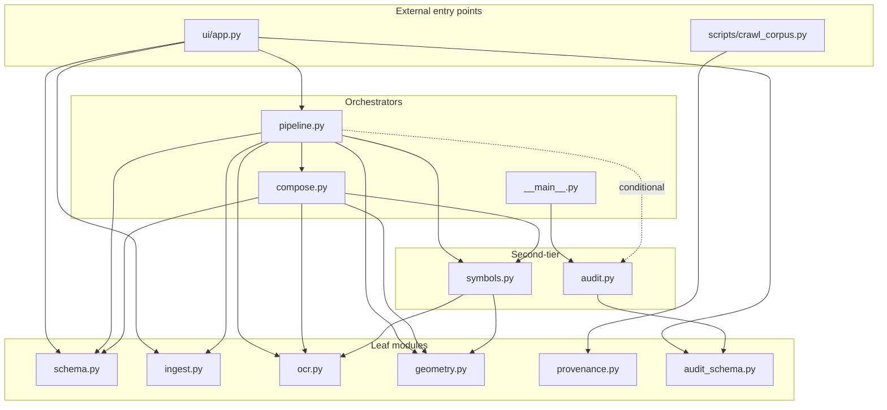

# Project Analysis — gem2-cad-tel

**Date:** 2026-08-17
**Analyzed version:** v0.1.6 (per `pyproject.toml` + `README.md`)
**Analyzer:** Claude (Opus 4.7 · 1M context) under TPMN work-plan WP-ST-1
**Method:** Static analysis of the tree (`find`, `grep`, `wc`, `git log`, targeted file reads). No `pytest` was run; no `docker compose up` was attempted. Every important claim carries an EEF tag (⊢ grounded / ⊨ inferred / ⊬ extrapolated / ⊥ unknown).

---

## 1 · Executive summary

**CAD Trust Engine Lite** is an auditable PNG/PDF floor-plan recognition engine targeting the **Korean ConTech 적산** (quantity-takeoff) domain. Its wedge is not detection accuracy — it is a **per-claim trust surface** where every output object carries three independent epistemic marks (type / geometry / measurement), where `measurement_mm` is Pydantic-gated by scale-anchor detection, and where refusals are first-class typed outputs rather than silent low-confidence detections. An opt-in SQLite audit trail records every run, stage event, refusal, and epistemic-tag distribution across time.

The codebase is **exceptionally clean** for its size (2,421 LOC in `src/`, 137 tests across 19 files): zero `TODO/FIXME/XXX/HACK` markers, zero `subprocess`/`eval`/`exec` calls, zero hardcoded absolute paths in shipping code, zero committed secrets, and 1-to-1 test coverage on every module. The load-bearing invariants (Measurement Policy, Refusal Over Bluff, License Discipline) are enforced **at the Pydantic layer** — outputs that violate them cannot be constructed.

The main deficits are **not correctness bugs** but hygiene gaps: no CI/CD is configured; the `deploy/Caddyfile` references docker-service DNS that the compose file does not provide (a fresh redeploy will fail); the corpus has 50 provenance records but only 42 sample images (8 orphans); `src/cad_trust/__init__.py` still reports `__version__ = "0.1.0"` while packaging says `0.1.6`; and the git history is a single seed commit (the substantive history lives in the upstream `gem2-vision` repo). None block use; all are addressable in a single afternoon.

---

## 2 · Identity + provenance

| Attribute        | Value                                                             |
| ---------------- | ----------------------------------------------------------------- |
| Repo slug        | `gem2-cad-tel`                                                    |
| Display name     | **CAD Trust Engine Lite**                                         |
| PyPI-style name  | `cad-trust-engine-lite` (per `pyproject.toml`)                    |
| Python package   | `cad_trust` (in `src/cad_trust/`)                                 |
| Historical name  | `gem2-vision` — still referenced in `docs/README.md`, `docs/AUDIT.md`, `Dockerfile` LABEL, and frozen `original_uri` fields in `data/provenance/*.json` |
| Live demo        | [`cad-tel.gemsquared.ai`](https://cad-tel.gemsquared.ai)          |
| Version          | `0.1.6` (⊢ pyproject + README) — but `__init__.py:__version__` still reports `0.1.0` |
| Author           | David Seo of GEM².AI · `david@gineers.ai`                          |
| License          | Proprietary source + public-licensed corpus (`docs/CORPUS.md`)     |
| Language mix     | Python 66.5 % · Markdown 20.2 % · JSON 7.7 % · Shell 4.4 % · TOML 0.8 % · YAML 0.5 % (of 8,773 text LOC) |

Release cadence (⊢ README L232-243): 7 tags cut between 2026-06-05 and 2026-06-14 — a two-week burst that shipped end-to-end pipeline, audit subsystem, real-world corpus, live-VPS deploy, portfolio reframing, and default-demo polish. Quiescent since 2026-06-14.

---

## 3 · Core design invariants (structurally enforced, not just documented)

### 3.1 · Measurement Policy

> `measurement_mm` may not be emitted unless `scale_anchor.detected = True`.

Enforcement lives in `src/cad_trust/schema.py:174-198` as a Pydantic `model_validator` on `EngineOutput`. Attempting to construct an `EngineOutput` where `scale_anchor.detected = False` but any `Object.measurement_mm is not None` raises `ValueError` at the compose boundary. Same enforcement applies to `Aggregates.measured_wall_length_mm.value` and all `Object.measurement_epistemic.tag` fields (which must be `⊥` in the no-scale case).

### 3.2 · Refusal Over Bluff

When evidence is insufficient (fewer than 2 supporting signals), the engine emits a `RefusalCandidate` (in `symbols.py`) that promotes to a top-level `EngineOutput.refusals: list[Refusal]` entry with a human-readable `why` string. Refusals are queryable in the audit DB (`refusals_log` table), so patterns across many runs become SQL-visible.

### 3.3 · EEF discipline for outputs

Every important claim carries one of four epistemic tags:

| Tag | Name         | Required companion field                       |
| :-: | ------------ | ---------------------------------------------- |
| ⊢   | GROUNDED     | `evidence` (direct — OCR hit, geometry match)   |
| ⊨   | INFERRED     | `evidence` + optional `derivation_chain`        |
| ⊬   | EXTRAPOLATED | `evidence` + **`basis`** (Pydantic-required)    |
| ⊥   | UNKNOWN      | **`gap`** (Pydantic-required)                   |

`EpistemicMark._check_basis_and_gap` refuses to construct `⊬` marks without a `basis` and `⊥` marks without a `gap`. This taxonomy is the same one TPMN uses at the meta-level for reasoning about the engine — the recursive self-consistency is intentional.

### 3.4 · License Discipline (corpus)

`ProvenanceRecord` (in `src/cad_trust/provenance.py`) refuses `license=None`, permits `check-required` (kept for human review), and hard-excludes 4 categories via `EXCLUDED_SOURCES`: Korean apartment marketing 분양자료, real-estate blog aggregation, Pinterest image scraping, and confidential construction-company PDFs. The corpus crawler (`scripts/crawl_corpus.py`) mirrors the same posture — Wikimedia sources whose license cannot be confidently mapped are logged in the refusal ledger, never optimistically promoted.

### 3.5 · Contract Before Implementation

The output schema (WP-ST-1 U2 historical unit) was committed before the detection code (U4-U9). This is why every stage function accepts and produces typed intermediate results — the schema shape gates the implementation direction rather than the other way around.

### 3.6 · Backward compatibility

Every release must pass the entire prior test suite. Historical progression: 53 → 91 → 130 → (currently 137 static; README claims 148). The audit subsystem (v0.1.1) was designed as a purely additive optional parameter — v0.1.0 callers pay zero overhead.

---

## 4 · Runtime architecture

### 4.1 · Module inventory

| Module              | LOC | Role                                                                   |
| ------------------- | --: | ---------------------------------------------------------------------- |
| `__init__.py`       |   3 | Package marker + `__version__` (stale — reads `"0.1.0"`)               |
| `__main__.py`       |   5 | CLI dispatch — `python -m cad_trust` → `audit.main()` only              |
| `provenance.py`     |  66 | `ProvenanceRecord` model — corpus provenance schema                    |
| `pipeline.py`       |  69 | Top-level orchestrator — `run(drawing_path, ..., audit_db_path?)`      |
| `audit_schema.py`   | 161 | SQLite schema init (6 tables + `PRAGMA user_version`)                  |
| `ingest.py`         | 166 | Stage 1 — PNG/JPG/PDF → canonical RGB ndarray                          |
| `ocr.py`            | 190 | Stage 3 — PaddleOCR ko+en + dim/label regex classification              |
| `schema.py`         | 199 | Pydantic contracts — `EngineOutput`, `Object`, EEF marks               |
| `geometry.py`       | 281 | Stage 2 — Canny + HoughLinesP + parallel-pair wall fusion              |
| `symbols.py`        | 375 | Stage 4 — HoughCircles + door/window/space detection + refusals        |
| `audit.py`          | 417 | Audit runtime: `AuditContext` + CLI (list-runs/show-run/refusals/stats)|
| `compose.py`        | 489 | Stage 5 — per-field EEF assembly + aggregates + `EngineOutput`         |
| **src total**       | **2,421** |                                                                    |
| `ui/app.py`         | 491 | Streamlit UI — 2 tabs (Run Engine, Past Runs)                          |

### 4.2 · Import dependency graph



Zero cycles. `pipeline.py:54` uses a function-local import of `AuditContext` (`# local import to avoid cycles`) as a defensive precaution even though no cycle exists — the concern is likely historical (audit code once imported pipeline for stage-name constants, since inverted).

### 4.3 · Pipeline (5 stages)

```
input (PNG | JPG | PDF path)
  ↓ ingest(path, dpi_target=200, audit?)      →  IngestResult (canonical RGB ndarray + metadata)
  ↓ extract_geometry(canonical, audit?)        →  GeometryResult (lines + wall_candidates)
  ↓ run_ocr(canonical, audit?)                 →  OCRResult (TextDetection[] with dim/label)
  ↓ detect_symbols(canonical, geom, ocr, audit?) →  SymbolResult (doors + windows + refusals)
  ↓ compose(drawing_id, canonical, geom, ocr, syms, audit?)
                                                → EngineOutput (Pydantic-validated,
                                                                Measurement Policy enforced)
```

**Execution mode**: on-demand, per-drawing, synchronous. Not batch, not streaming. Batch use = caller-side loop.

**Audit thread**: every stage function accepts `audit=ctx` (an `AuditContext`). When `audit_db_path` is `None` and env var `GEM2_VISION_AUDIT_DB` is unset, the pipeline short-circuits to the v0.1.0 path *before importing* the audit module — genuinely zero cost.

### 4.4 · Entry points

| Entry                           | Command                                       | Purpose                                      |
| ------------------------------- | --------------------------------------------- | -------------------------------------------- |
| Streamlit UI                    | `streamlit run ui/app.py`                     | Primary human-facing surface (2 tabs)         |
| Audit CLI                       | `python -m cad_trust`                         | list-runs / show-run / refusals / stats       |
| Audit CLI (equivalent)          | `python -m cad_trust.audit`                   | Same as above                                 |
| Corpus builder                  | `python scripts/build_corpus.py`              | Regenerates 12 synthetic drawings             |
| Corpus crawler                  | `python scripts/crawl_corpus.py --target 25`  | Fetches from Wikimedia Commons                |
| Docker service                  | `docker compose -f deploy/docker-compose.yml up` | Full deploy stack (loopback + host Caddy) |

**Note**: there is **no** top-level CLI for running the pipeline on a single drawing. Batch consumers must call `from cad_trust.pipeline import run` in Python. This is intentional — `__main__.py` docstring says "the only CLI we ship in v0.1.1".

---

## 5 · Data model

### 5.1 · `EngineOutput` — the primary contract

```
EngineOutput
├── drawing_id: str
├── objects: list[Object]
│   └── Object
│       ├── object_id: str
│       ├── type: Literal[10 kinds]  — wall_{wet,dry,structural} | door | window
│       │                              | balcony_sash | inspection_hatch
│       │                              | dimension_text | room_label | space_polygon
│       ├── type_epistemic:        EpistemicMark
│       ├── geometry:              Geometry (kind ∈ bbox|polyline|polygon; coords_px)
│       ├── geometry_epistemic:    EpistemicMark
│       ├── measurement_mm:        float | None  (gated by scale_anchor)
│       ├── measurement_epistemic: EpistemicMark
│       └── review_status:         Literal[auto_accepted | needs_human | rejected]
├── aggregates: Aggregates
│   ├── wall_count:                Aggregate(value, epistemic, warning?)
│   ├── door_count:                Aggregate
│   ├── window_count:              Aggregate
│   └── measured_wall_length_mm:   Aggregate
├── refusals: list[Refusal]
│   └── Refusal(region=bbox, why=human-readable)
└── scale_anchor: ScaleAnchor(detected, px_per_mm, source)
```

Every model uses `ConfigDict(extra="forbid")` — unknown fields are rejected at construction.

### 5.2 · `ProvenanceRecord` — the corpus contract

Every `data/samples/{stem}.{png,jpg,pdf}` has a matching `data/provenance/{stem}.json` with fields: `drawing_id`, `source`, `license` ∈ 6 categories, `sha256`, `fetched_at`, `original_uri`, `usage`, `domain` ∈ {`global`, `kr`, `dwg_demo`}. Uncertain licenses go to `check-required`; unmappable licenses are refused entirely.

### 5.3 · Audit DB schema (6 tables)

- `runs` — one row per pipeline invocation (drawing_id, timestamps, exit_state)
- `stage_events` — per-stage entry/exit/arbitrary events
- `epistemic_counts` — tag-distribution rollups keyed by (run_id, stage, tag, field)
- `refusals_log` — every refusal candidate + promoted refusal
- `policy_fires` — Measurement_Policy + future invariant fires
- `schema_meta` — key/value; includes version marker mirroring `PRAGMA user_version = 1`

All timestamps are ISO8601 UTC text. `init_audit_db()` is idempotent. `No_Silent_Audit_Failures` invariant: sqlite errors → `warnings.warn` + continue (never abort the pipeline).

---

## 6 · External integrations

| # | Integration                    | Purpose                                        | Auth / secrets           |
| - | ------------------------------ | ---------------------------------------------- | ------------------------ |
| 1 | Wikimedia Commons API          | Corpus expansion via `scripts/crawl_corpus.py` | None — polite UA + 0.5 s throttle |
| 2 | PaddleOCR model downloads      | First-call model fetch (ko + en, ~500 MB)      | None; cache in `~/.paddleocr/` |
| 3 | BYO LLM key (v0.1.5+, v0.2 use) | User's own API key for future VLM re-check   | Client-side only — `st.session_state`, session-scoped |
| 4 | Poppler                        | System binary for `pdf2image`                   | None                    |
| 5 | Vultr VPS + Caddy 2            | Deployment target with Let's Encrypt auto-TLS  | Domain owner control    |
| 6 | MCP servers                    | **Not used** — `.mcp.json = {"mcpServers": {}}` | —                      |

---

## 7 · Dependencies

**Runtime** (⊢ `pyproject.toml` + `requirements.txt`, both aligned):

| Category      | Packages                                                                             |
| ------------- | ------------------------------------------------------------------------------------ |
| CV core       | `opencv-python-headless>=4.10`, `numpy>=1.26,<2.2`                                   |
| Image I/O     | `pdf2image>=1.17` (+ `poppler-utils` apt), `pillow>=10.4`                            |
| OCR           | `paddleocr>=2.8`, `paddlepaddle>=2.6.1` (+ `libgl1`, `libglib2.0-0` apt for opencv transitive) |
| Contracts     | `pydantic>=2.8`                                                                       |
| UI            | `streamlit>=1.38`                                                                     |
| ⚠ Declared unused | `fastapi>=0.115` + `uvicorn>=0.30` — zero imports; reserved for the deferred v0.3 web-API |

**Dev** (⊢ `pyproject.toml [dev]`): `pytest>=8.3`, `pytest-cov>=5.0`, `ruff>=0.6`.

**System**: `poppler-utils` (both `packages.txt` for Streamlit Cloud and `Dockerfile`), plus `curl`, `ca-certificates`, `libgl1`, `libglib2.0-0`, `tini` in the Docker image only.

---

## 8 · Test posture

- **19** test files under `tests/`, **137** static `def test_` functions, 2,325 test LOC
- **1:1 test-per-module** coverage on every `src/cad_trust/*.py` except `__init__.py`
- **Fast subset**: `pytest --ignore=tests/test_corpus_pipeline_smoke.py` → ~97 s, 134 tests
- **Full suite** including corpus-wide smoke: ~10 minutes
- Fixture strategy: files on disk in `tests/fixtures/` (`golden_output.json`, `ingest_test.pdf`, `smoke_text.png`, `make_smoke_image.py`) — no `conftest.py`, tests reference paths directly
- pytest config: `[tool.pytest.ini_options] testpaths=["tests"] addopts="-ra -q"` — minimal
- Ruff config: `line-length=100`, `target-version=py311`

**Gaps** (⊬ not exercised): Streamlit runtime widgets, Docker container startup, Caddy TLS negotiation, BYO LLM-key sidebar E2E, multi-page PDF warning path.

⚠ **No CI/CD**: `.github/workflows/` does not exist; no other CI config present. Every push relies on manual `pytest` runs. Test-count claim in README (`148`) diverges from static count (`137`); parametrization cannot explain the gap.

---

## 9 · Deploy posture

Three paths — each documented and self-consistent within itself:

### 9.1 · Local dev

```bash
uv venv --python 3.12 .venv && source .venv/bin/activate
uv pip install -e ".[dev]"
brew install poppler                              # macOS  (apt install poppler-utils on Debian)
.venv/bin/python scripts/build_corpus.py          # 12 synth samples
.venv/bin/python -m pytest --ignore=tests/test_corpus_pipeline_smoke.py
.venv/bin/python -m streamlit run ui/app.py       # → localhost:8501
```

### 9.2 · Devcontainer / Codespaces

`.devcontainer/devcontainer.json` uses `mcr.microsoft.com/devcontainers/python:1-3.11-bookworm` and auto-starts the Streamlit UI on attach with `--server.enableXsrfProtection false` (intentional for Codespaces iframe preview; diverges from `.streamlit/config.toml`).

### 9.3 · VPS production

```bash
# One-time host bootstrap (idempotent)
ssh -i ~/.ssh/id_ed25519_aio_deploy user@host 'bash -s' < deploy/bootstrap.sh

# Deploy (idempotent, includes healthcheck + smoke)
./deploy/deploy.sh user@host --domain cad-tel.example.com
```

- **Container**: `python:3.12-slim` + apt (poppler, curl, ca-certs, libgl1, libglib2.0-0, tini) + pip, non-root user `cadtrust:1000`, healthcheck via `curl :8501/_stcore/health`
- **Compose**: single-service mode, `mem_limit: 2g`, loopback-only port binding `127.0.0.1:8501:8501`, named volume `audit_data` → `/data/`
- **Host Caddy**: reverse-proxies `:443` → `localhost:8501`, auto-TLS via Let's Encrypt when `DOMAIN` is set
- **Firewall**: ufw allows SSH:22, HTTP:80, HTTPS:443
- **Env vars**: `GEM2_VISION_AUDIT_DB=/data/audit.sqlite`, `DOMAIN=…`

### 9.4 · Secrets surface

| Item                        | Storage                                    | Repo-tracked? |
| --------------------------- | ------------------------------------------ | ------------- |
| SSH deploy key              | Local `~/.ssh/id_ed25519_aio_deploy`       | No           |
| VPS `.env` (DOMAIN only)    | `/opt/cad-tel/.env` on VPS                 | No           |
| LLM API key (BYO)           | Client `st.session_state`                  | No           |
| Streamlit secrets           | `.streamlit/secrets.toml`                  | No (excluded via `.gitignore` + rsync `--exclude`) |
| Audit DB                    | `/data/audit.sqlite` (named volume)        | No           |

⊢ **No secrets are committed**. Verified via `.gitignore` inspection (L34-39, L73 cover `.env`, `*.pem`, `*.key`, `.streamlit/secrets.toml`) and no `.env` file present.

---

## 10 · Risk register (13 items · 3 significant, 10 minor)

| # | Sev. | Class            | Finding                                                                        |
| - | ---- | ---------------- | ------------------------------------------------------------------------------ |
| 1 | ⚠⚠   | deploy           | `deploy/Caddyfile` references `streamlit:8501` (docker DNS) but `deploy/docker-compose.yml` does not bundle Caddy and only exposes `127.0.0.1:8501`. A fresh redeploy applying the Caddyfile verbatim to a host-based Caddy will fail. |
| 2 | ⚠⚠   | corpus integrity | 50 provenance JSONs vs 42 sample images → **8 orphan provenance records**. README claims "50-sample corpus". |
| 3 | ⚠⚠   | observability    | Git history is a single seed commit — the 7-release history exists only in the upstream `gem2-vision` repo. |
| 4 | ⚠⚠   | CI/CD             | No CI configured — no `.github/workflows/`, no other CI file. |
| 5 | ⚠    | dependency       | `fastapi` + `uvicorn` declared in both manifests; zero imports. Reserved for v0.3 web-API per README L344. |
| 6 | ⚠    | version drift    | `src/cad_trust/__init__.py:__version__ = "0.1.0"` vs pyproject/README `0.1.6`. |
| 7 | ⚠    | security (dev)   | Devcontainer disables XSRF (justified for Codespaces iframe; add a comment). |
| 8 | ⚠    | security (dev/prod leak) | `.streamlit/config.toml:21` sets `showErrorDetails = "full"` — full tracebacks to browser. |
| 9 | ⚠    | doc drift        | README claims 148 tests, static count is 137. |
| 10 | ⚠   | name drift       | Legacy `gem2-vision` in `docs/README.md`, `docs/AUDIT.md`, Dockerfile LABEL. Provenance URIs are correctly frozen (do not edit). |
| 11 | ⚠   | coverage tool declared, not configured | `pytest-cov` in dev deps but no `.coveragerc` and no `--cov=…` in addopts. |
| 12 | ⚠   | not tested        | Streamlit widgets, Docker container startup, Caddy TLS, BYO LLM-key flow, multi-page PDF warning. |
| 13 | ⚠   | static-only verification | Tests not run in this analysis; the "148 pass" narrative is unverified — a future session should run `pytest --ignore=tests/test_corpus_pipeline_smoke.py`. |

### Positive findings (worth naming — unusually clean for the size)

- Zero `TODO / FIXME / XXX / HACK` markers in shipping code
- Zero `subprocess / shell=True / os.system / eval / exec` — no shell-injection surface
- Zero hardcoded absolute paths (`/Users/…`, `/tmp/…`, `/opt/…`) in shipping code
- Zero committed secrets
- Every `src/` module (except `__init__.py`) has a companion test file
- Structural invariant enforcement at Pydantic layer (violations impossible by construction)
- Backward compatibility preserved across 7 releases
- Non-root container user (uid 1000 `cadtrust`)
- Loopback-only container binding + host Caddy = defense-in-depth
- Named volume for audit DB (persistence across container restarts)
- Idempotent bootstrap + deploy scripts with strict `set -euo pipefail`
- Contract-first design (schema committed before detection code)
- License Discipline for corpus mirrors the runtime EEF taxonomy

---

## 11 · Prioritized remediation punch list

**Ship-blocker fixes (if v0.1.7 is cut):**
1. Reconcile `Caddyfile` ↔ `docker-compose.yml` — pick host-Caddy (`localhost:8501` + rename to `Caddyfile.example`) OR bundle Caddy in compose (Risk #1)
2. Reconcile corpus count (either restore 8 missing images or garbage-collect orphan provenance; then update docs to match) (Risk #2)
3. Bump `src/cad_trust/__init__.py:__version__` to `"0.1.6"` — or replace it with `importlib.metadata.version(...)` and let packaging be the source (Risk #6)

**High-value additions:**
4. Add minimal GitHub Actions CI — `pytest --ignore=…smoke` + `ruff check` on push, ~50 lines YAML for a portfolio project (Risk #4)
5. Remove unused `fastapi` + `uvicorn` unless v0.3 web-API is imminent (Risk #5)

**Nice-to-haves:** Items 7-13 as listed — none block use, each removes small friction.

---

## 12 · Fastest path for a new contributor

1. Read this document (you just did).
2. Read the module you plan to touch — every module has a docstring header.
3. If changing an `EngineOutput` shape, run `tests/test_schema.py` first — it names what is structurally forbidden.
4. If changing the pipeline, read `pipeline.py` (69 LOC) — that's the whole orchestration.
5. If changing the UI, most non-Streamlit logic lives in `ui/app.py` helpers tested by `tests/test_ui_preview.py`.
6. Before believing the "148 tests pass" narrative, run: `pytest --ignore=tests/test_corpus_pipeline_smoke.py`.

---

## 13 · Method + provenance of this analysis

This document was produced by Claude (Opus 4.7 · 1M context) under a TPMN work-plan (`WP-ST-1`) invoked via `/plan-work` → `/proceed-work` → `/verify-work` → `/notify-david`. Nine unit-works were executed:

1. Repo inventory + language surface
2. Project identity + purpose
3. Runtime architecture
4. Data flows + external integrations
5. Dependencies inventory
6. Test posture
7. Deploy + runtime posture
8. Risks + unknowns
9. Portrait synthesis (this document + `.gem-squared/evidences/00-index.md`)

Deep-dive artifacts for each unit live under `.gem-squared/evidences/01…08.md` (gitignored — internal cognitive-OS state). This document (`docs/PROJECT_ANALYSIS_2026-08-17.md`) is the public-facing self-contained version.

Every important system/dev claim in this document carries an epistemic tag (⊢ / ⊨ / ⊬ / ⊥) per the same EEF discipline the engine itself uses. Where a claim was not directly verifiable from the current tree, the basis for the extrapolation (⊬) or the gap that keeps it unknown (⊥) is named explicitly.

*— End of analysis*
